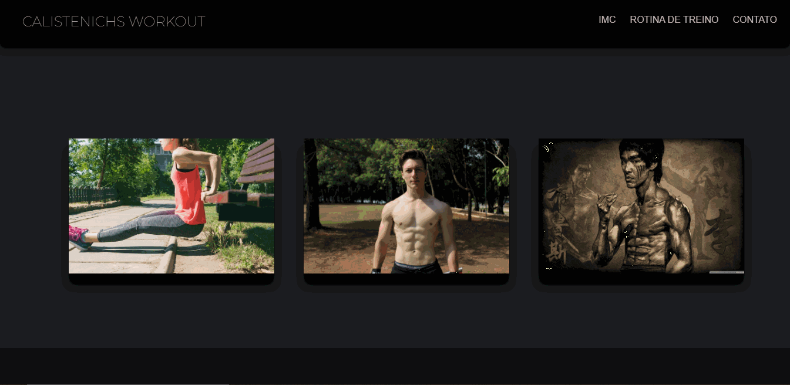

# CalistenichsWEB
 Site de calistenia desenvolvido com HTML, CSS e JS.

[Live: ](https://calistenichs-web.vercel.app/)

## Baixe o projeto BRUTO:

### Sem o git instalado:

    1. Baixe o arquivo em ZIP pelo GitHub
    
    2. Extraia e execute o Index.html

### Com o git instalado:
    1. git clone: https://github.com/VitorVeector/CalistenichsWEB
    
    2. Execute Index.html

 > Página desenvolvida para   práticar semântica de HTML, CSS e JavaScript e será utilizada como portifólio de meu perfil

 ### Página Principal
 

 ### Calculadora do IMC
 

 ### Página de rotinas de treino
  

### Página de contato

### Página responsiva

